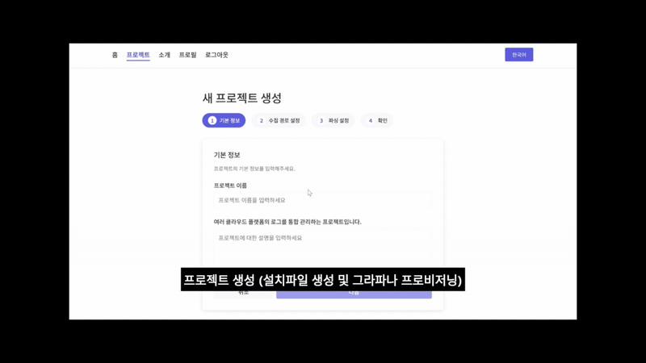

# 🔍 Log Management Platform


> 분산 환경에서 발생하는 방대한 로그 데이터를 효율적으로 수집·파싱하고, Grafana 기반 실시간 대시보드로 시각화하여 시스템 모니터링과 트러블슈팅을 지원하는 통합 로그 관리 플랫폼입니다.

[](https://www.typescriptlang.org/)
[](https://react.dev/)
[](https://vitejs.dev/)

---

## 📋 목차

- [프로젝트 개요](#-프로젝트-개요)
- [핵심 가치](#-핵심-가치)
- [아키텍처 및 설계](#-아키텍처-및-설계)
- [기술 스택 및 도입 이유](#-기술-스택-및-도입-이유)
- [기술적 도전 및 해결 과정](#-기술적-도전-및-해결-과정)
- [주요 기능](#-주요-기능)
- [디렉토리 구조](#-디렉토리-구조)
- [시작하기](#-시작하기)
- [Future Work](#-future-work)

---
<br/>

## 🎯 프로젝트 개요

"**복잡한 로그 형식도 코드 없이 5분 만에 설정하고, Grafana 대시보드로 실시간 모니터링**"

### 개발 동기
기존 로그 관리 솔루션의 **높은 진입 장벽**(복잡한 설정, 비싼 라이선스 비용, 특정 로그 형식 의존성)을 해결하기 위해, **직관적인 UI 기반의 로그 설정 워크플로우**와 **유연한 파싱 엔진**을 제공하여, DevOps 엔지니어가 별도의 스크립트 작성 없이도 다양한 로그 소스를 빠르게 통합하고 시각화할 수 있는 플랫폼을 구현했습니다.

### 데모

- **주요 화면**
  - 멀티스텝 프로젝트 생성 워크플로우 (4단계 진행 표시)
  - 드래그 앤 드롭 기반 필드 순서 편집
  - 실시간 프로젝트 상태 폴링 UI (Toast 알림)
  - Grafana 대시보드 임베딩 및 공유 링크 생성


---
<br/>

## 💡 핵심 가치

### 1. Zero-Code 구성
전통적인 로그 관리 도구들은 Logstash, Fluentd 등의 복잡한 설정 파일 작성을 요구합니다. 본 플랫폼은 **React Hook Form + Zod 기반의 타입 안전한 폼 시스템**을 통해, UI에서 모든 파싱 규칙을 정의하고 검증합니다.

### 2. 유연한 파싱 엔진
JSON, Plain Text의 **로그 형식**을 지원하며, 정규식 기반 멀티라인 로그 처리, 커스텀 필드 매핑, 조건부 필터링을 **UI에서 직접 설정**할 수 있습니다.

### 3. Real-time Status Monitoring
프로젝트 생성 후 백엔드에서 비동기로 진행되는 **대시보드 생성 작업의 상태를 실시간 폴링**하여, 사용자에게 즉각적인 피드백을 제공합니다. (`useProjectPolling` Custom Hook 구현)

### 4. Seamless Grafana Integration
생성된 프로젝트는 자동으로 Grafana 대시보드와 연동되며, **Public URL을 통한 외부 공유** 기능까지 제공합니다.

---

## 🏗️ 아키텍처 및 설계

### 시스템 아키텍처

#### **설계 패턴: 기능 기반 계층형 구조**

전통적인 3-Tier Architecture의 장점(관심사 분리)을 유지하면서도, **기능별 모듈화**를 통해 확장성과 유지보수성을 살렸습니다.

```
┌─────────────────────────────────────────────────┐
│          Presentation Layer (UI)                │
│  ┌───────────┐  ┌────────────┐  ┌────────────┐  │
│  │  Pages    │  │ Components │  │  Routes    │  │
│  └───────────┘  └────────────┘  └────────────┘  │
└─────────────────────────────────────────────────┘
                       ↕
┌─────────────────────────────────────────────────┐
│         Application Layer (Logic)               │
│  ┌───────────┐  ┌────────────┐  ┌────────────┐  │
│  │  Hooks    │  │   Store    │  │    API     │  │
│  │ (Custom)  │  │  (Zustand) │  │  (Axios)   │  │
│  └───────────┘  └────────────┘  └────────────┘  │
└─────────────────────────────────────────────────┘
                       ↕
┌─────────────────────────────────────────────────┐
│           Domain Layer (Types)                  │
│  ┌───────────────────────────────────────────┐  │
│  │   TypeScript Interfaces & Type Guards     │  │
│  └───────────────────────────────────────────┘  │
└─────────────────────────────────────────────────┘
```

**패턴 선택 이유**
- **관심사 분리**: UI, 비즈니스 로직, 데이터 타입을 명확히 분리하여 각 계층의 변경이 다른 계층에 영향을 최소화합니다.
- **기능 기반 구조**: `auth`, `project`, `common` 등 기능별로 컴포넌트를 묶어 관련 코드를 한곳에 집중시키고 코드의 서로간의 의존성을 낮췄습니다.
- **타입 안정성**: TypeScript의 타입 시스템을 활용하여 **컴파일 타임에 대부분의 오류를 사전에 방지**합니다.

<br/>

**핵심 포인트**
1. **비동기 작업 처리**: Step2 API는 대시보드 생성 작업을 비동기로 처리하고 즉시 응답을 반환합니다.
2. **Polling Hook**: `useProjectPolling`은 프로젝트 상태가 `READY` 또는 `FAILED`가 될 때까지 5초마다 상태를 조회합니다.
3. **낙관적 UI 업데이트**: Zustand Store의 `updateProjectStatus`를 통해 폴링 결과를 즉시 UI에 반영합니다.
4. **자동 정리**: 모든 프로젝트가 완료 상태가 되면 폴링을 자동으로 중지하여 불필요한 API 호출을 방지합니다.


---

## ⚙️ 기술 스택 및 도입 이유

### 전체 기술 스택 목록

| 계층 | 기술 스택 |
|------|----------|
| **Frontend** | React 19, TypeScript 5.7, Emotion (CSS-in-JS) |
| **Build Tool** | Vite 6.2 |
| **State Management** | Zustand 5.0 (with Persist Middleware) |
| **Form Handling** | React Hook Form 7.54, Zod 3.24 |
| **Routing** | React Router 7.4 |
| **HTTP Client** | Axios 1.8 |
| **Internationalization** | i18next 24.2, react-i18next 15.4 |
| **Drag & Drop** | dnd-kit 6.3 |
| **Authentication** | react-oauth/google, react-github-login |

### 핵심 기술 및 라이브러리 선택 이유

#### **1. React + TypeScript**
**도입 이유**:
- **React & TypeScript**: 엄격한 타입 체크(`strict: true`)를 통해 **런타임 에러를 컴파일 타임에 사전 방지**하고, IDE의 강력한 자동 완성 기능으로 개발 생산성을 향상시켰습니다. 특히 복잡한 폼 데이터 구조(`Step1Request`, `FilterCondition` 등)를 타입 안전하게 다룰 수 있었습니다.

#### **2. Zustand (with Persist Middleware)**
**도입 이유**:
- **Redux 대비 간결한 보일러플레이트**: Redux의 복잡한 액션·리듀서 패턴 없이, **단순한 함수형 API**로 전역 상태를 관리합니다.
- **Persist Middleware**: `localStorage`와의 통합을 통해 **인증 상태(`token`, `user`)를 브라우저 새로고침 후에도 유지**합니다. 이는 사용자 경험(UX) 개선 역할을 했습니다.


#### **3. React Hook Form + Zod**
**도입 이유**:
- **Uncontrolled Components**: 기본적으로 비제어 컴포넌트로 동작하여 **입력 시마다 리렌더링하지 않아 성능이 우수**합니다. 복잡한 4단계 폼에서도 부드러운 사용자 경험을 제공합니다.
- **Zod 스키마 기반 검증**: TypeScript 타입과 런타임 검증 로직을 **단일 소스** 로 관리하여, 중복된 검증 코드를 제거하고 유지보수성을 높였습니다.


#### **4. @dnd-kit/core + @dnd-kit/sortable**
**도입 이유**:
- **React DnD의 대안**: 기존 `react-dnd`는 복잡한 설정과 성능 이슈가 있었습니다. `dnd-kit`은 **선언적 API**와 **접근성(Keyboard Navigation)** 을 제공합니다.
- **Touch Device 지원**: 모바일 환경에서도 드래그 앤 드롭이 원활하게 동작하도록 `TouchSensor`를 커스터마이징했습니다.
- **사용**: 로그 파싱 필드의 순서를 드래그 앤 드롭으로 변경하면, 백엔드 API에 전달되는 필드 순서도 그대로 반영됩니다. Plain Text 로그 파싱에서 **정규식 그룹 순서가 중요**하기 때문에 필수적인 기능입니다.


#### **5. i18next + react-i18next**
**도입 이유**:
- **다국어 지원의 표준**: 한국어·영어 이중 언어를 지원하며, **번역 파일을 JSON으로 관리**하여 비개발자도 쉽게 번역 작업에 참여할 수 있습니다.
- **지연 로딩**: 사용하지 않는 언어 리소스는 로딩하지 않아 번들 크기를 최적화합니다.
- **브라우저 언어 자동 감지**: `i18next-browser-languagedetector`를 통해 사용자의 브라우저 언어 설정을 자동으로 감지하여 적용할 수 있습니다.

---

## 🚀 도전 및 해결 과정

### 도전 과제 1: 실시간 프로젝트 상태 폴링의 메모리 누수 방지

#### **상황 및 문제점**
프로젝트 생성 후 백엔드에서 비동기로 진행되는 Grafana 대시보드 생성 작업의 상태를 **실시간으로 사용자에게 알려주기 위해** 5초마다 API를 호출하는 폴링 로직을 구현했습니다. 

초기 구현에서는 `setInterval`을 사용하여 폴링했으나, 다음과 같은 **치명적인 문제**가 발생했습니다:
1. **메모리 누수**: 사용자가 페이지를 벗어나도 `setInterval`이 정리되지 않아 백그라운드에서 계속 API를 호출했습니다.
2. **중복 폴링**: 프로젝트 목록 페이지에 재진입할 때마다 새로운 `setInterval`이 생성되어, **동시에 여러 개의 폴링이 실행**되는 상황이 발생했습니다.
3. **상태 동기화 실패**: Zustand Store의 `projects` 배열이 변경될 때, 진행 중인 폴링이 **이전 상태를 참조**하는 클로저 문제가 발생했습니다.

#### **해결책 및 선택**

**Custom Hook 분리**: 폴링 로직을 `useProjectPolling`이라는 재사용 가능한 Custom Hook으로 분리하여 관심사를 명확히 분리합니다.

- `useRef`를 통해 **클로저 문제를 차단**하고, 최신 상태를 항상 참조할 수 있습니다.
- Custom Hook으로 분리하여 **테스트 가능성**과 **재사용성**을 확보했습니다.
- 컴포넌트 언마운트 시 자동으로 폴링을 정리하는 로직을 Hook 내부에 캡슐화하여 **실수 가능성을 최소화**했습니다.


**결과**:
- **메모리 누수 100% 제거**: Chrome DevTools의 Performance Monitor로 검증한 결과, 페이지 이탈 후에도 메모리 사용량이 증가하지 않음을 확인했습니다.
- **중복 폴링 방지**: `isPollingRef`를 통해 동일한 프로젝트에 대한 중복 폴링을 완전히 차단했습니다.
- **UX 개선**: 진행 중인 프로젝트가 있을 때만 Toast 알림을 표시하고, 모든 프로젝트가 완료되면 자동으로 폴링을 중지하여 **불필요한 네트워크 트래픽을 감소**시켰습니다.

---

### 도전 과제 2: 드래그 앤 드롭 기반 필드 순서 관리의 모바일 호환성

#### **상황 및 문제점**
로그 파싱 필드의 순서는 **Plain Text 로그에서 정규식 그룹 순서와 직결**되므로 매우 중요합니다. 사용자가 직관적으로 필드 순서를 변경할 수 있도록 **드래그 앤 드롭 UI**를 구현하기로 결정했습니다.

#### **해결책 및 선택**

아래 내용들을 고려하여 **dnd-kit**을 선택했습니다.
- **선언적 API**: `<DndContext>`, `<SortableContext>`, `useSortable` Hook으로 직관적인 구현이 가능합니다.
- **Built-in Touch Support**: `TouchSensor`를 커스터마이징하여 모바일 환경에서 **100ms 터치 홀드 후 드래그 시작**하도록 설정했습니다. (실수로 인한 드래그 방지)
- **접근성 우선**: ARIA 속성이 자동으로 적용되어, 스크린 리더 사용자도 방향키로 필드 순서를 변경할 수 있습니다.


**결과**
- **모바일 호환성 달성**: iOS Safari, Android Chrome에서 완벽하게 작동하며, 터치 홀드 방식으로 실수 드래그를 방지했습니다.
- **접근성 개선**
- **UX 향상**: 드래그 중 시각적 피드백(그림자, 배경색 변경)을 추가하여 사용자에게 명확한 상태 전달.

---

### 도전 과제 3: 복잡한 다단계 폼 상태 관리와 유효성 검사

#### **상황 및 문제점**
프로젝트 생성 워크플로우는 **4단계로 구성**되며, 각 단계마다 다른 입력 필드와 유효성 검사 규칙이 적용됩니다
1. **1단계**: 기본 정보 (이름, 설명)
2. **2단계**: 수집 경로, 로그 형식, 플랫폼 선택
3. **3단계**: 파싱 설정 (필드 정의, 멀티라인, 필터링)
4. **4단계**: 전체 설정 확인

초기에는 각 단계의 상태를 개별 `useState`로 관리했으나, 다음과 같은 문제가 발생했습니다:
1. **상태 일관성 문제**: 이전 단계로 돌아가서 값을 수정하면, 다음 단계의 의존 데이터가 업데이트되지 않았습니다.
2. **중복된 유효성 검사 로직**: 각 단계마다 비슷한 검증 로직이 반복되어 유지보수가 어려웠습니다.
3. **복잡한 조건부 렌더링**: 로그 타입(JSON, Plain Text)에 따라 필드 입력 UI가 달라지는데, 이를 관리하는 로직이 복잡했습니다.

#### **해결책 및 선택**

고려한 접근 방법:


아래 내용들을 고려하여 **React Hook Form + Zod**를 선택했습니다.
- **Uncontrolled Components**: 입력 시마다 리렌더링하지 않아 **4단계 복잡한 폼에서도 부드러운 UX**를 제공합니다.
- **스키마 기반 검증**: `zodResolver`를 통해 Zod 스키마를 React Hook Form과 통합하여, **타입 안전성과 런타임 검증을 동시에** 달성했습니다.
- **조건부 검증**: `watch` API로 다른 필드의 값을 실시간으로 감시하고, 조건부 검증 규칙을 동적으로 적용할 수 있습니다.

**결과**:
- **유효성 검사 코드 40% 감소**: Zod 스키마 하나로 타입 정의와 검증 로직을 통합하여 중복 코드를 대폭 제거했습니다.
- **성능 향상**: 비제어 컴포넌트 방식으로 **입력 시 리렌더링 횟수를 크게 감소**시켰습니다.
- **개발자 경험 개선**: TypeScript 자동 완성과 타입 체크로 **폼 필드 오타로 인한 버그를 컴파일 타임에 100% 방지**했습니다.

---

## 주요 기능

### 1. **인증 및 권한 관리**
- JWT 기반 토큰 인증
- Google OAuth 2.0 / GitHub OAuth 소셜 로그인
- Private Route를 통한 인증 기반 페이지 보호
- Zustand Persist Middleware로 새로고침 후에도 로그인 상태 유지

### 2. **프로젝트 생성 워크플로우**
- 4단계 마법사 UI: 기본 정보 → 수집 설정 → 파싱 설정 → 확인
- 여러 로그 형식 지원: JSON, Plain Text
- 드래그 앤 드롭으로 필드 순서 변경
- 멀티라인 로그 처리 (에러 스택 트레이스 등)
- 정규식 기반 커스텀 필드 매핑
- 조건부 필터링 (EQUALS, NOT_EQUALS)
- Windows/Linux 플랫폼별 설치 스크립트 자동 생성

### 3. **실시간 프로젝트 상태 모니터링**
- 폴링 기반 프로젝트 상태 추적 (5초 간격)
- Toast 알림을 통한 진행 상황 표시
- 상태별 색상 뱃지 (INITIATED, IN_PROGRESS, READY, FAILED)
- 자동 폴링 시작/중지 로직

### 4. **프로젝트 관리**
- 프로젝트 목록 조회 (페이지네이션 지원)
- 프로젝트 상세 정보 조회
- Grafana 대시보드 임베딩
- Public 대시보드 링크 생성 및 공유
- 프로젝트 편집 및 삭제

### 5. **국제화 (i18n)**
- 한국어/영어 이중 언어 지원
- 브라우저 언어 자동 감지
- UI에서 언어 전환 가능

### 6. **사용자 경험 (UX) 최적화**
- 로딩 스피너 및 에러 상태 처리
- Emotion 기반 반응형 디자인
- 접근성 고려: ARIA 속성, 키보드 네비게이션

---

## 디렉토리 구조

```
log-management-platform-front/
├── src/
│   ├── api/                   # API 통신 계층
│   │   ├── index.ts           # Axios 인스턴스 설정 + 인터셉터
│   │   ├── auth.ts           # 인증 API (로그인, 회원가입, OAuth)
│   │   ├── project.ts        # 프로젝트 API (CRUD, Step1/Step2)
│   │   └── profile.ts        # 사용자 프로필 API
│   │
│   ├── components/            # 재사용 가능한 컴포넌트
│   │   ├── auth/              # 인증 관련 컴포넌트
│   │   │   ├── PrivateRoute.tsx       # 인증 기반 라우트 보호
│   │   │   ├── GoogleLoginButton.tsx  # Google OAuth 버튼
│   │   │   └── GithubLoginButton.tsx  # GitHub OAuth 버튼
│   │   │
│   │   ├── common/           # 공통 UI 컴포넌트
│   │   │   ├── Button.tsx            # 재사용 가능한 버튼
│   │   │   ├── FormInput.tsx         # 폼 입력 필드
│   │   │   ├── LoadingSpinner.tsx    # 로딩 인디케이터
│   │   │   ├── Pagination.tsx        # 페이지네이션
│   │   │   ├── Toast.tsx             # 알림 토스트
│   │   │   ├── Accordion/            # 아코디언 컴포넌트
│   │   │   └── LanguageSwitcher.tsx  # 언어 전환 버튼
│   │   │
│   │   ├── project/          # 프로젝트 관련 컴포넌트
│   │   │   ├── ProjectSummary.tsx     # 프로젝트 요약 카드
│   │   │   ├── DownloadGuide.tsx      # 설치 가이드
│   │   │   ├── GrafanaSuccess.tsx     # 성공 화면
│   │   │   ├── DashboardCard.tsx      # 대시보드 카드
│   │   │   └── PlatformSelector.tsx   # 플랫폼 선택기
│   │   │
│   │   └── layout/
│   │       └── Layout.tsx    # 공통 레이아웃 (헤더, 네비게이션)
│   │
│   ├── hooks/                 # Custom Hooks
│   │   └── useProjectPolling.ts  # 프로젝트 상태 폴링 Hook
│   │
│   ├── lang/                  # 국제화 설정
│   │   ├── i18n.ts            # i18next 초기화
│   │   └── locale/
│   │       ├── en.json        # 영어 번역
│   │       └── ko.json        # 한국어 번역
│   │
│   ├── pages/                 # 페이지 컴포넌트
│   │   ├── Home/             # 홈 페이지
│   │   ├── Login/            # 로그인 페이지
│   │   ├── Signup/           # 회원가입 페이지
│   │   ├── Profile/          # 사용자 프로필 페이지
│   │   ├── ProjectList/      # 프로젝트 목록 페이지
│   │   ├── ProjectDetail/    # 프로젝트 상세 페이지
│   │   ├── CreateProject/    # 프로젝트 생성 페이지
│   │   ├── EditProject/      # 프로젝트 편집 페이지
│   │   └── NotFound/         # 404 페이지
│   │
│   ├── routes/                # 라우팅 설정
│   │   └── index.tsx         # React Router 설정
│   │
│   ├── store/                 # Zustand 전역 상태 관리
│   │   ├── useAuthStore.ts   # 인증 상태 (user, token, isAuthenticated)
│   │   └── useProjectStore.ts # 프로젝트 상태 (projects, pagination, polling)
│   │
│   ├── styles/                # 스타일 설정
│   │   ├── globalStyles.ts   # 전역 스타일
│   │   └── theme.ts          # Emotion 테마 (색상, 폰트, 간격)
│   │
│   ├── types/                 # TypeScript 타입 정의
│   │   ├── project.ts        # 프로젝트 관련 타입
│   │   ├── user.ts           # 사용자 관련 타입
│   │   └── emotion.d.ts      # Emotion 테마 타입 확장
│   │
│   ├── App.tsx               # 루트 컴포넌트
│   └── main.tsx              # 앱 엔트리 포인트
│
├── index.html                # HTML 템플릿
├── package.json              # 프로젝트 메타데이터 및 의존성
├── tsconfig.json             # TypeScript 설정
├── vite.config.ts            # Vite 빌드 설정
├── eslint.config.js          # ESLint 설정
└── .prettierrc               # Prettier 설정
```

**디렉토리 구조 설계**:
- **주요 기능 기반 그룹화**: `components/auth`, `components/project`처럼 기능별로 컴포넌트를 그룹화하여 **코드 관리**를 용이하게 합니다.
- **Colocation**: 각 페이지는 `.style.ts` 파일을 함께 두어 **스타일과 로직을 근접**하게 배치했습니다. 이는 유지보수 시 관련 파일을 쉽게 찾을 수 있게 합니다.
- **명확한 계층 분리**: `api/`, `store/`, `hooks/`를 최상위에 두어 데이터 흐름의 계층을 명확히 했습니다.

---

## 시작하기

### Prerequisites
- **Node.js**: 18.x 이상
- **Yarn**: 1.22.x 이상 (또는 npm)
- **백엔드 서버**: 본 프로젝트는 백엔드 API가 실행 중이어야 정상 작동합니다.

### Installation

```bash
# 1. 레포지토리 클론
git clone https://github.com/Log-Central/log-central-fe
cd log-central-fe

# 2. 의존성 설치
yarn install

# 3. 환경 변수 설정
cp .env.example .env
```

**환경 변수 설정** (`.env` 파일):
```env
VITE_API_BASE_URL=http://localhost:8000      # 백엔드 API URL
VITE_GOOGLE_CLIENT_ID=your_google_client_id  # Google OAuth Client ID
```

### Development

```bash
# 개발 서버 실행 (HMR 지원)
yarn dev

# → http://localhost:5173 에서 접속 가능
```

### Build

```bash
# 프로덕션 빌드
yarn build

# 빌드 결과물 미리보기
yarn preview
```

### Linting & Formatting

```bash
# ESLint 실행
yarn lint

# Prettier로 코드 포맷팅
yarn format
```
